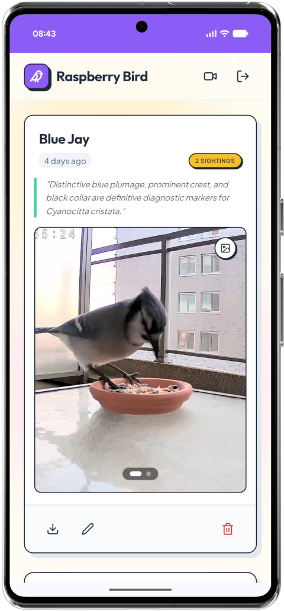
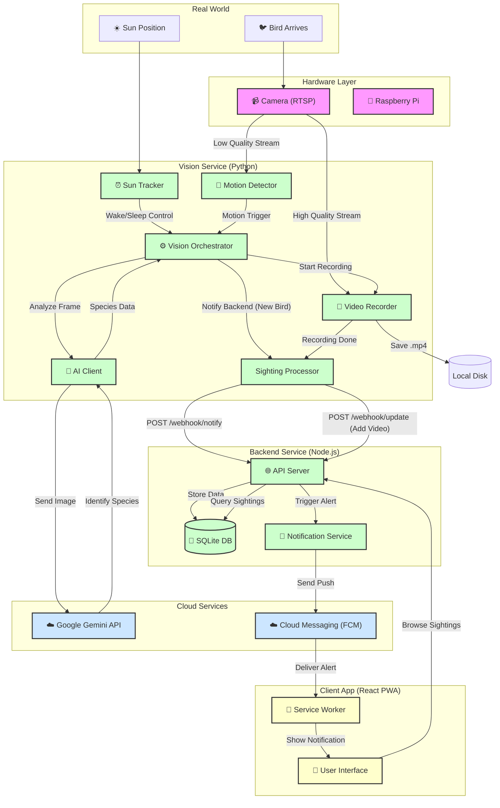

# 🐦 Raspberry Bird

A professional-grade, AI-powered bird monitoring system designed for the Raspberry Pi. This dual-stream system captures 2K video while using lightweight AI models for real-time species identification, featuring a modern, bold user interface.


<p align="center">
  
</p>

---

## 📖 Project Overview

Raspberry Bird solves the problem of "missing the moment" with nature photography. By constantly monitoring a video stream and using advanced AI to filter out false positives (leaves, shadows), it autonomously curates a collection of high-quality bird videos.

### Key Features
*   **🤖 AI Ornithologist**: Identifies bird species using Google Gemini 2.5 Flash with scientific precision.
*   **🎨 Playful Geometric UI**: A high-energy dashboard built with bold borders, hard shadows, and a vibrant color palette.
*   **📹 Dual-Stream Architecture**: 
    *   **Low Quality Stream**: Analyzed for motion at high frequency.
    *   **High Quality Stream**: Recorded directly to disk in 2K resolution.
*   **🔔 Real-time Notifications**: Web Push alerts delivered to your devices within seconds of identification.
*   **🧹 Smart Storage**: Automated file cleanup based on configurable disk usage thresholds.
*   **🌙 Smart Hibernation**: Dynamically calculates sunrise to sleep exactly until dawn, saving energy and resources.
*   **📡 Deep Monitoring**: Intelligently throttles polling frequency during quiet periods to minimize CPU heat and power.
*   **👻 Anti-Ghosting**: Requires consecutive motion detections to filter out transient false positives like wind or shadows.
*   **🎯 Detection Zones (ROI)**: Define specific areas of interest (like the feeder tray) to ignore background distractions.
*   **⚡ Speculative Capture (Pre-ID Recording)**: Starts the HQ recording *before* the AI identification finishes, ensuring the landing and initial "moment" are never missed.
*   **🖼️ Smart Image Alignment**: Extracts motion coordinates and dynamically pans landscape images on the frontend so birds are always perfectly centered.
*   **📊 CSV Event Logging**: Automatically records all system events and detections to a structured CSV file for offline analysis.
*   **📱 Native-Like PWA**: Fast, installable app experience for iOS and Android.

---

## 🛠️ Technology Stack

| Component | Technology | Description |
| :--- | :--- | :--- |
| **Vision** | Python, OpenCV (System), Gemini | Motion detection and AI Analysis |
| **Backend** | Node.js (v22 Native Modules) | API, Persistence (SQLite), and Push |
| **Frontend** | React 18, Vite, Tailwind v4 | Responsive PWA dashboard |
| **Design** | Playful Geometric | Bold borders, hard shadows, Outfit font |

---

## 🏗️ System Architecture

The system follows a **Hub-and-Spoke** architecture where the Raspberry Pi acts as the central "Hub" for all physical interactions, and the Backend Server acts as the "Spoke" for data persistence and remote access.

### High-Level Flow
1.  **Capture**: The Camera captures a video stream.
2.  **Detect**: The Vision System analyzes the stream for motion.
3.  **Analyze**: Upon motion, the AI Client identifies the species.
4.  **Notify**: The Backend Server stores the event and pushes a notification.
5.  **View**: The User accesses the video via the Client App.



---

## ✨ Design Aesthetics (New!)

The system features a **Playful Geometric** design system that prioritizes clarity and tactile energy:
*   **Bold Contrast**: Every card and button uses a `2px` foreground border for a sharp, distinct silhouette.
*   **Hard Geometric Shadows**: Real-world tactile feeling using offset solid shadows (`shadow-pop`).
*   **Vibrant Palette**: Uses `Indigo-600` primary accents combined with playful pinks and golden yellows.
*   **Tactile Feedback**: Interactive elements scale and shift on hover and click, mirroring the "pop" of the visuals.
*   **Instagram-Style Media**: Rich cards with a `4:5` aspect ratio specifically chosen for avian photography.

---

## 📂 Core Modules

*   **`/vision`**: The python service running on the Raspberry Pi. Orchestrated by `VisionService`, it decomposes logic into `SunTracker`, `SightingProcessor`, `MotionDetector`, and `GeminiClient` for robust, modular processing.
*   **`/server`**: The Node.js API. Handles the `sightings` database, serves the frontend, and manages push subscriptions.
*   **`/client`**: The React source code for the PWA dashboard.

---

## ⚙️ Configuration

System-wide behavioral settings are managed in `config/settings.yaml`, while deployment-specific secrets and location context are stored in `.env`.

```yaml
# Motion Detection
MOTION_THRESHOLD: 100       # Lower = More sensitive
MIN_AREA_PIXELS: 10000     # Size of object to track
MOTION_CHECK_INTERVAL_MS: 1000 # How often to read/check frames
MOTION_ANALYSIS_WIDTH: 480  # Downscale frame for faster detection
MOTION_VERIFICATION_FRAMES: 2 # Consecutive detections needed
MOTION_DETECTION_ROI: [0,0,100,100] # [ymin, xmin, ymax, xmax] %

# Storage
MAX_DISK_USAGE_PERCENT: 90 # Auto-delete oldest files if exceeded
VIDEO_DURATION_SECONDS: 30 # Length of HQ recording

# Advanced (Optimization)
SIGHTING_COOLDOWN_MINUTES: 1.5 # Anti-spam
ANALYSIS_COOLDOWN_SECONDS: 10 # Rate limit for AI calls
DEEP_MONITORING_INTERVAL_MS: 2000 # Polling during quiet periods
DEEP_MONITORING_THRESHOLD_MINUTES: 5 # Time until deep sleep
```

---

## 🚀 Installation & Usage

### 1. Prerequisites
*   **Hardware**: Raspberry Pi 3B+ / 4 / 5 or any Linux/Mac host.
*   **Node.js**: v22.5+ (Required for built-in `node:sqlite`).
*   **Python**: 3.9+.
*   **System Tools**: `ffmpeg` (for recording) and `python3-opencv` (for vision).
    ```bash
    # On Raspberry Pi / Debian:
    sudo apt update
    sudo apt install ffmpeg python3-dev python3-opencv
    ```

### 2. Environment Setup
Create a `.env` file in the root directory (copy from `.env.example`):
```properties
GEMINI_API_KEY=your_key
INTERNAL_API_KEY=your_internal_key  # For Vision Service communication
RTSP_URL_LQ=rtsp://...
RTSP_URL_HQ=rtsp://...
VAPID_PUBLIC_KEY=...
VAPID_PRIVATE_KEY=...
VITE_SIGHTINGS_PER_PAGE=20 # Optional: Customize dashboard pagination
# ... see .env.example for more
```

### 3. Reverse Proxy / Cloudflare Tunnel (Optional)
This system is pre-configured for deployment behind a reverse proxy or Cloudflare Tunnel (e.g., at a sub-path like `/bird`).

**Cloudflare Tunnel Setup:**
1. Point your tunnel to `http://localhost:3100`.
2. If using a sub-path (e.g., `https://yourdomain.com/bird`), the app is already configured to handle this via the `base: '/bird/'` setting in Vite.
3. Ensure the backend sets `trust proxy` (default is enabled) to handle HTTPS headers correctly.

### 4. 🚀 How to Start Application

#### Option A: Local / Development Phase

**Terminal 1: Server (Node.js)**
```bash
cd server
npm install
npm run seed # Create admin user from .env
npm run dev
```

**Terminal 2: Client (React)**
```bash
cd client
npm install
npm run dev
```

**Terminal 3: Vision (Python)**
```bash
cd vision
# Create venv with access to system OpenCV/NumPy
python3 -m venv venv --system-site-packages
source venv/bin/activate
pip install -r requirements.txt
python main.py
```

#### Option B: Permanent Deployment (Raspberry Pi / Production)

Use **PM2** to run both the Node.js server and Python vision module permanently in the background. They will automatically start on boot and resume upon failure.

```bash
# 1. Install PM2 globally
sudo npm install pm2 -g

# 2. Navigate to project root and start all services using the PM2 ecosystem file
pm2 start ecosystem.config.js

# 3. Register PM2 to start on system boot
pm2 startup
# (Important: Run the specific bash command PM2 prints to your terminal output)

# 4. Save the active process list
pm2 save
```

**Useful PM2 Commands:**
*   `pm2 logs`: View real-time combined logs for both Node and Python.
*   `pm2 status`: Check the running status of your services.
*   `pm2 restart ecosystem.config.js`: Restart all services.
*   `pm2 stop ecosystem.config.js`: Stop all services.

### 5. 💡 Usage Examples

*   **View Live Dashboard:** Open `http://localhost:5173` (or your production URL) in a browser to view the live dashboard.
*   **Manage Notifications:** Click the bell icon in the top right header to grant permissions and subscribe to real-time push alerts.
*   **Review Sightings:** Scroll through the feed to review past sightings. Swipe on a sighting's carousel to view the high-quality 2K video.
*   **Edit Sighting:** Click the pencil icon on a sighting card to correct AI misidentifications. The overarching sighting counts will update automatically.

### 6. 🧪 How To Run Tests
This project uses manual verification steps:
1.  **Default Login:**
- **User:** `admin` (or `DEFAULT_ADMIN_USER`)
- **Pass:** `admin` (or `DEFAULT_ADMIN_PASSWORD`)
2.  **Unit Logic**: Check logs in `vision/` for "Motion detected" events.
3.  **Integration**: Verify that a new row appears in `birdfeeder.sqlite` after a detection.
4.  **End-to-End**: Ensure the PWA updates with the new card design and the notification is received.

### 7. 🛠️ Maintenance & Updates
An `update.sh` script is provided in the project root to automate the deployment of new changes to your Raspberry Pi. This script switches to `main`, pulls the latest code, and rebuilds the frontend client.

```bash
# From the project root:
./update.sh
```

---

## 🤝 Contribution Guidelines
1.  **Branching**: Use `feature/name` or `fix/name`.
2.  **Aesthetics**: Follow the Material You design patterns defined in `client/src/index.css`.
3.  **Comments**: Ensure all new files have block headers and JSDoc/Docstrings as per `MEMORY[commenting-guidelines.md]`.
4.  **Linting**: Ensure code is clean and follows the Separation of Concerns (SoC) principle.

---

## 🔌 API Endpoints Summary

*   **User Access** (Requires Session Cookie)
    *   `GET /api/sightings`: JSON list of all birds.
    *   `PATCH /api/sightings/:id`: Update sighting metadata.
    *   `DELETE /api/sightings/:id`: Remove a sighting.
    *   `GET /api/config`: Get VAPID public key.
    *   `POST /api/subscribe`: Save push notification endpoint.
*   **System/M2M** (Requires `X-API-Key`)
    *   `POST /api/webhook/notify`: Internal webhook for new detections.
    *   `POST /api/webhook/update`: Update detection with HQ assets.
*   **Public**
    *   `POST /api/auth/login`: User Session management.

See `server/README.md` for full API documentation.
